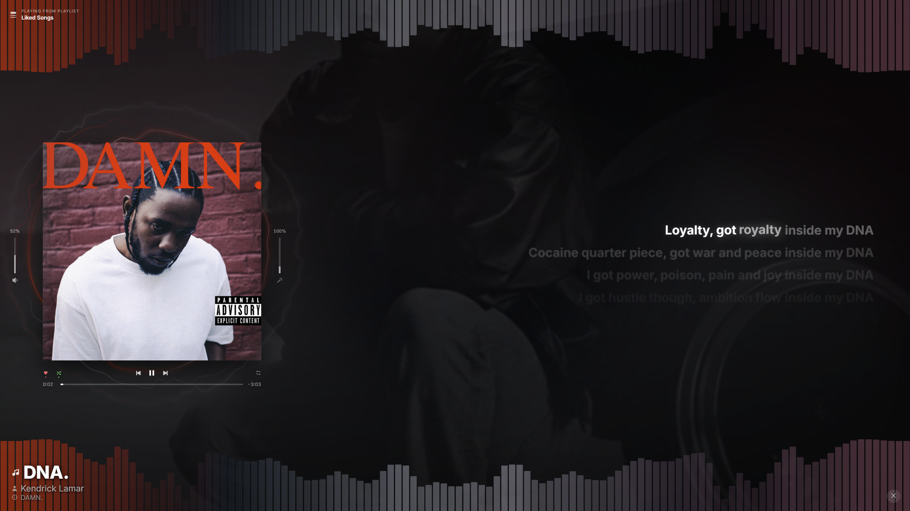

# Fullscreen Player for Spicetify

*NOTE THIS WAS MADE COMPLETELY USING GENERATIVE AI*

A fullscreen now-playing view: album art with a live, audio-reactive ring
visualizer and full-width spectrum bars, synced (word-level, where available)
lyrics, Canvas/artist-image backdrops, and a compact transport — built as a
Spicetify extension.



## What makes this different from a normal extension

Spotify's own audio-analysis service was removed from the desktop client, and
the Web API equivalent was deprecated for new apps in late 2024. That means
**no Spicetify extension can get real audio data from Spotify's own APIs
anymore** — every "reactive visualizer" you see today is either running on
borrowed time (a grandfathered API token) or faking it from playback
position alone.

This one gets real reactivity a different way: a small companion process
(the **bridge**) captures Spotify's own audio output directly from Windows
(WASAPI per-process loopback — it hears *only* Spotify, not your game, your
calls, or anything else), runs an FFT on it, and streams the spectrum to the
extension over a local WebSocket. No API, no deprecation risk, full genre
coverage.

**The bridge is optional.** Without it, the extension still works fully —
art, lyrics, transport, everything — the rings just fall back to a gentle
ambient motion instead of tracking the actual audio.

## Requirements

- [Spicetify](https://spicetify.app) already installed and working
- **For audio reactivity only:** Windows 10 (build 20348+) or Windows 11,
  and [Node.js](https://nodejs.org) 18 or later
- Lyrics and Canvas/artist-image backdrops work without the bridge, but the
  bridge also proxies the lyrics lookups (see [Why a bridge?](#why-a-bridge)),
  so lyrics are more reliable with it running

## Install — the extension

1. Download `extension/fullscreenPlayer.js` from this repo.
2. Copy it into your Spicetify Extensions folder:
   - Windows: `%appdata%\spicetify\Extensions\`
   - macOS/Linux: `~/.config/spicetify/Extensions/`
3. In a terminal:
   ```
   spicetify config extensions fullscreenPlayer.js
   spicetify apply
   ```
4. Reload Spotify (Ctrl+Shift+R with devtools enabled, or just restart it).
5. Open the fullscreen view from the new icon in Spotify's top bar (three
   concentric arcs, next to the other topbar buttons), or press
   **Ctrl+Shift+F**.

That's it for a working, non-reactive version with lyrics and a nice UI.
If that's all you want, stop here.

## Install — the audio bridge (optional, for reactive visuals)

This is what makes the rings actually respond to the music. It's a second,
independent piece — a small Node process — because nothing running inside
Spotify's own window can access system audio; that sandbox is the whole
point of a browser-style renderer, and Spotify decodes audio outside it
entirely.

1. Download the `bridge/` folder from this repo somewhere permanent, e.g.
   `C:\Tools\spicetify-fullscreen-bridge\`.
2. Open that folder in File Explorer, click the address bar, type
   `powershell`, press Enter.
3. Install dependencies:
   ```
   npm install
   ```
4. With Spotify open and playing something, test it:
   ```
   npm run debug
   ```
   You should see a line like `[bridge] capturing Spotify (pid 12345)`
   and a text meter that moves with the music. Play something else (a
   YouTube video, a game) at the same time — the meter should **not**
   react to it. That confirms the per-process capture is working. Ctrl+C
   to stop.
5. Pick how you want it to run day-to-day — see below.

### Running it day-to-day

Two options; pick one.

**A. A launcher that starts Spotify and the bridge together (recommended
if you don't want anything running when you're not listening to music).**

Use `bridge/launch-spotify.vbs`. It starts Spotify, then starts the bridge
with `--exit-with-spotify`, so the bridge quits the moment Spotify closes.
Make a shortcut to it and put that shortcut wherever you'd normally launch
Spotify from (Start menu, taskbar) in place of your usual Spotify shortcut.

If Spotify isn't installed at the default path
(`%appdata%\Spotify\Spotify.exe` — Microsoft Store installs live elsewhere),
edit the path at the top of `launch-spotify.vbs`.

**B. Start at login, idle until Spotify opens.**

Put a shortcut to `bridge/bridge-silent.vbs` in your Startup folder
(Win+R → `shell:startup`). It checks for Spotify every 2 seconds (near-zero
cost while idle) and attaches/detaches automatically as Spotify opens and
closes.

## Using it

| Key | Action |
|---|---|
| Ctrl+Shift+F | Open/close the fullscreen view |
| Esc | Close |
| Space | Play/pause |
| ←  /  → | Seek back/forward (hold to accelerate) |
| Shift + ← / → | Previous/next track |
| ↑ / ↓ | Volume |
| F | Toggle real fullscreen (hides Spotify's window chrome) |
| [ / ] | Nudge lyric sync for the current track (saved per track) |
| \\ | Reset lyric sync for the current track |
| L | Cycle the lyrics source for the current track (auto / LRCLIB / Better Lyrics) |
| + / - | Resize lyrics (or drag the slider next to the artwork) |
| D | Toggle a debug readout (bridge status, lyrics source, timings) |

Clicking any lyric line seeks to it. The volume and progress bars are
draggable. The up-next card appears only in the last 20 seconds of a track.

## Why a bridge? <a name="why-a-bridge"></a>

Two unrelated things needed something outside Spotify's own sandbox, so one
small process handles both:

**Audio.** As above — Spotify decodes and plays audio natively; there is no
Web Audio node for a page script to attach an analyser to, on any Spicetify
extension, ever. Capturing the actual waveform requires a native OS capture
API, which only a real process (not a page) can call. The bridge uses
Windows' documented per-process WASAPI loopback API — the same mechanism
[OBS uses for "application audio capture."](https://github.com/WerdoxDev/loopback-capture)
via the `loopback-capture` npm package.

**Lyrics.** The lyrics lookups this extension uses ([LRCLIB](https://lrclib.net)
for line-level lyrics, and the [Better Lyrics API](https://lyrics-api-docs.boidu.dev)
for word/syllable-level timing where available) don't send
`Access-Control-Allow-Origin` headers, so a browser blocks Spotify's page
from calling them directly. A local process has no such restriction, so the
bridge also runs a tiny HTTP proxy on the same port and the extension routes
lyrics requests through it. Without the bridge running, the extension still
tries these directly and will hit CORS for Better Lyrics but LRCLIB and any
in-client lyrics API generally still work.

## What's inside

```
extension/
  fullscreenPlayer.js     the Spicetify extension — this is the only file
                           that goes in your Extensions folder

bridge/
  bridge.js                the audio-capture + lyrics-proxy process
  package.json
  launch-spotify.vbs       option A: launches Spotify + bridge together
  bridge-silent.vbs        option B: runs at login, idles until Spotify opens

docs/
  how-it-works.txt         a from-scratch write-up of the whole audio
                           pipeline: capture, FFT, smoothing, rendering
```

## Third-party dependencies — read this before you install

In the interest of being upfront about exactly what this runs:

- **[`loopback-capture`](https://github.com/WerdoxDev/loopback-capture)**
  (npm) — a small, single-maintainer package that wraps Microsoft's own
  published WASAPI process-loopback sample in a native (C++) Node addon.
  It's MIT licensed with public source, and its binaries are built by GitHub
  Actions from that source (npm trusted publishing) rather than uploaded by
  hand, which is the main thing that makes a native dependency trustworthy.
  It is, however, a low-usage project from one author. Look at it yourself
  before installing if that matters to you; the bridge does nothing else
  with elevated privilege or network access beyond this and the two lyrics
  APIs below.
- **[LRCLIB](https://lrclib.net)** — a free, community-run lyrics database
  that explicitly welcomes third-party API use. No key required.
- **[Better Lyrics API](https://lyrics-api-docs.boidu.dev)** — a free public
  API providing word/syllable-level timing (TTML) where available. Please
  be considerate with request volume if this project gets popular; it's
  someone else's free service.

None of the above requires a Spotify account token, login credentials, or
anything beyond track title/artist/duration to look up lyrics, and the
bridge makes no outbound network connections other than to these two lyrics
hosts — audio capture and the WebSocket/HTTP server are entirely local.

## Known limitations

- **Windows only**, for the audio bridge. macOS/Linux users get the full UI,
  lyrics, and Canvas/artist backdrops, just not audio-reactive rings —
  per-process loopback capture is a Windows-specific API.
- **Lyrics coverage varies.** Both lyrics sources are community-maintained
  and strongest on well-known, older, or chart-popular music. Obscure or
  very recent tracks may have no synced lyrics, or occasionally match a
  different edit of a track — press **L** to try another source, or
  **[** / **]** to nudge the offset if the match is right but shifted.
- **Canvas and artist-image backdrops use internal, undocumented Spotify
  GraphQL endpoints.** These can change or break on a Spotify update
  without notice; the extension fails silently back to a blurred cover in
  that case.
- Spotify updates will overwrite Spicetify's patches. Run
  `spicetify backup apply` after an update to reinstate the extension.

## License

GNU GPLv3 — see [LICENSE](LICENSE).
